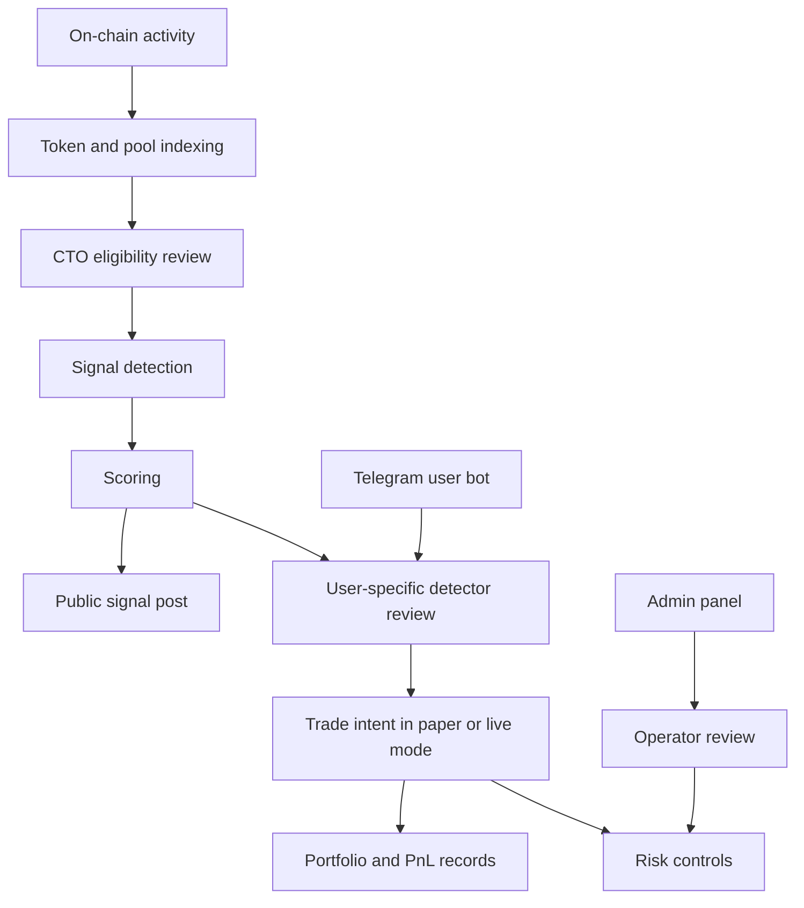

# System Model

This page explains Lazarus as a product system without exposing private source code.

## High-Level Model

Lazarus has three layers:

1. **Market intelligence layer**
   - Watches token, pool, holder, liquidity, and activity data.
   - Turns raw observations into scored signals.

2. **User product layer**
   - Presents alerts and settings through Telegram.
   - Stores user preferences, wallet records, subscriptions, and referral state.

3. **Operator layer**
   - Gives the team a control surface for users, revenue, referrals, health, and launch readiness.

## Conceptual Flow

## Public Signal Path

The public signal channel is intentionally simple:

1. A token shows comeback activity.
2. Lazarus evaluates the signal.
3. The score passes the public channel threshold.
4. The notifier posts a formatted Telegram alert.
5. The post links to outside tools for independent verification.

The signal channel should bias toward fewer, clearer posts.

## User Bot Path

The user bot is personalized:

1. User starts the bot.
2. The bot creates or loads the user account.
3. The user sees trial/subscription status.
4. The user adds or generates wallets.
5. The user selects a detector and trading profile.
6. The user reviews portfolio/PnL.
7. Paper trading can be used for validation.
8. Live trading remains gated.

## Data Ownership Model

Market data can be shared globally. User data must be scoped:

| Data | Scope |
|---|---|
| Token metadata | Global |
| Pool data | Global |
| Signal records | Global plus tenant decisions |
| Wallets | Tenant/user |
| Detector settings | Tenant |
| Trading settings | Tenant |
| Trade intents | Tenant/user/wallet |
| Positions and trades | Tenant/user/wallet |
| Subscriptions | Tenant |
| Referrals | Tenant/user |
| Portfolio snapshots | Tenant/user/wallet |

## Risk Model

Lazarus should not treat live trading as just another toggle. Live trading requires:

- User acknowledgement.
- Operator feature flag.
- Early allowlist.
- Active wallet.
- Active subscription.
- Budget limits.
- Per-token caps.
- Daily loss limits.
- Per-wallet execution locks.
- Kill switch and halt controls.

## Why Telegram First

Crypto users already use Telegram for discovery, alerts, coordination, and fast decisions. Lazarus keeps the primary product in that workflow instead of forcing users into a separate dashboard.

The web surface exists for internal administration, not as the main user product.

